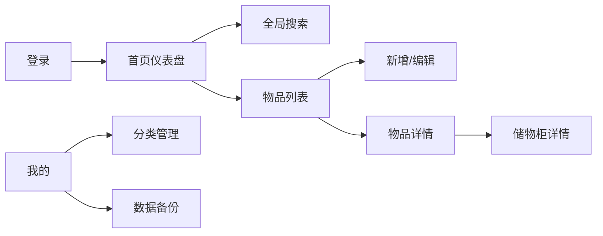
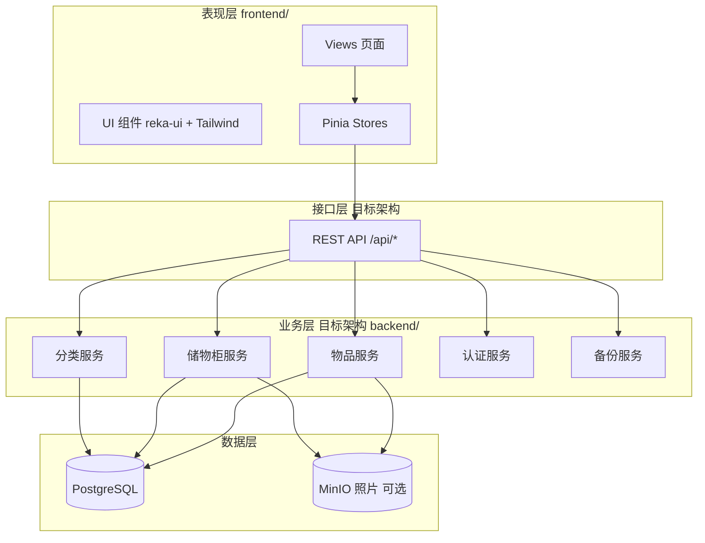
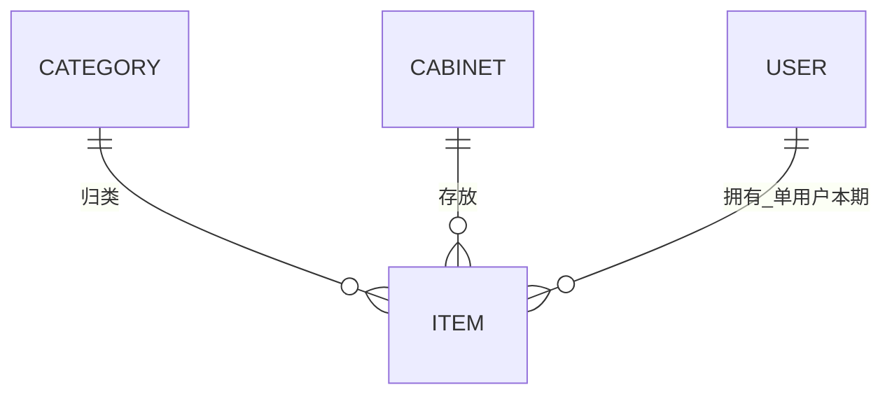

# 概要设计：物品收纳

> 基于《需求文档.md》及 `frontend/` 原型实现整理  
> 文档版本：1.0.0 | 更新日期：2026-05-26

---

## 第一章 需求分析

### 1.1 模块数量统计

本系统共 **5** 个核心业务模块：

| 序号 | 模块名称 | 类型 | 说明 |
|------|----------|------|------|
| M1 | 物品管理 | 增删改查类 | 物品 CRUD、照片、筛选 |
| M2 | 储物柜管理 | 增删改查类 | 储物柜 CRUD、关联物品展示 |
| M3 | 分类管理 | 增删改查类 | 分类 CRUD、排序、关联处理 |
| M4 | 搜索与仪表盘 | 非增删改查类 | 全局搜索、首页统计、时间快捷筛选 |
| M5 | 用户与系统 | 非增删改查类 | 演示登录、备份导入导出、缓存清理 |

**页面数量**：14 个（含登录页），底部 Tab 4 个：首页、物品、储物柜、我的。

### 1.2 功能需求清单

#### M1 物品管理

| 功能 | 类型 | 输入 | 输出 | 业务规则 |
|------|------|------|------|----------|
| 创建物品 | C | 名称、分类ID、照片≤3、存放日期、储物柜ID、备注 | 物品记录 | R001 名称 2-50 字；R010 默认今天；R006/R007 照片限制 |
| 查询列表 | R | 关键字、分类、时间区间 | 分页/虚拟滚动列表 | 默认按 createdAt 倒序 |
| 编辑物品 | U | 同创建 | 更新记录 | R011 变更储物柜时级联更新数量 |
| 删除物品 | D | 物品ID | 删除成功 | 二次确认；R012 储物柜计数 -1 |
| 物品详情 | R | 物品ID | 详情+轮播 | 可跳转储物柜详情 |

#### M2 储物柜管理

| 功能 | 类型 | 输入 | 输出 | 业务规则 |
|------|------|------|------|----------|
| 创建储物柜 | C | 名称、照片≤3、位置描述 | 储物柜记录 | R002 名称 2-30 字；R005 名称唯一 |
| 查询列表 | R | 关键字、创建时间区间 | 列表+物品数量角标 | 关键字匹配名称/位置 |
| 编辑/删除 | U/D | 表单/ID | 更新/删除 | R008 有物品时禁止删除 |
| 柜内物品 | R | 储物柜ID | 关联物品列表 | 一对多：一件物品仅属一柜 |

#### M3 分类管理

| 功能 | 类型 | 输入 | 输出 | 业务规则 |
|------|------|------|------|----------|
| CRUD 分类 | C/R/U/D | 名称、排序 | 分类列表 | R003/R004；R009 删除时处理关联物品 |
| 拖拽排序 | U | sortOrder | 更新顺序 | 影响首页卡片顺序 |

#### M4 搜索与仪表盘

| 功能 | 类型 | 说明 |
|------|------|------|
| 首页仪表盘 | 非CRUD | 分类统计卡片、最近新增、储物柜入口 |
| 全局搜索 | 非CRUD | 防抖 300ms；物品/储物柜 Tab；R013 匹配优先级 |
| 时间快捷筛选 | 非CRUD | 今天/本周/本月/自定义闭区间 R014 |

#### M5 用户与系统

| 功能 | 类型 | 说明 |
|------|------|------|
| 演示登录 | 非CRUD | admin@example.com / password |
| 数据备份 | 非CRUD | JSON 导出/导入；R016-R019 |
| 清除缓存 | 非CRUD | 清空本地数据，二次确认 |

### 1.3 页面与路由（原型已实现）

| 页面 | 路由 | Tab/层级 |
|------|------|----------|
| 登录 | `/login` | 独立 |
| 首页 | `/home` | Tab-首页 |
| 搜索 | `/search` | 二级 |
| 物品列表/新增/详情/编辑 | `/items` 等 | Tab-物品 |
| 储物柜列表/新增/详情/编辑 | `/cabinets` 等 | Tab-储物柜 |
| 分类/备份 | `/categories`、`/backup` | 我的-二级 |
| 我的 | `/profile` | Tab-我的 |

### 1.4 角色与权限

单角色 **家庭管理员**，登录后访问全部页面与操作（见需求文档第六章权限矩阵）。

### 1.5 码值设计

| 枚举类型 | 中文名 | 枚举值 | 说明 | 使用位置 |
|----------|--------|--------|------|----------|
| ItemLifecycleStatus | 物品生命周期 | DRAFT, NORMAL, DELETED | 草稿/正常/已删除 | 物品状态机 |
| CabinetLifecycleStatus | 储物柜状态 | NORMAL, HAS_ITEMS, DELETED | 空柜/有物品/已删除 | 储物柜删除校验 |
| CategoryDeleteStrategy | 分类删除策略 | DELETE_ITEMS, MOVE_TO_UNCATEGORIZED | 一并删除/转至未分类 | 分类删除 R009 |
| BackupImportMode | 备份导入模式 | MERGE, OVERWRITE | 合并/覆盖 | R018 |
| TimeFilterPreset | 时间筛选预设 | TODAY, WEEK, MONTH, CUSTOM | 快捷时间 | 列表筛选 |

### 1.6 交互设计规范（源自原型）

| 维度 | 规范 |
|------|------|
| 布局 | 移动竖屏；状态栏+顶栏+滚动区+底 Tab；内容区 padding 16px；卡片圆角白底 |
| 底 Tab | 首页/物品/储物柜/我的；选中高亮+填充图标；未选中灰色线框图标（lucide-vue-next） |
| 触控 | 按钮最小 44×44px；字体最小 14px |
| 列表 | 垂直卡片列表；物品/储物柜支持左滑删除（物品列表） |
| 表单 | 分组表单；必填校验；未保存返回二次确认 |
| 照片 | 最多 3 张；压缩宽 1280px、≤500KB；轮播+双击放大 |
| 反馈 | Toast 成功/失败；删除二次确认 Dialog |
| 搜索 | 输入防抖 300ms |
| 主题 | Tailwind CSS；分类卡片渐变配色（ins 温暖色调） |

### 1.7 场景与系统串联

**核心数据流**：分类、储物柜为独立主数据；物品通过 `category_id`、`cabinet_id` 关联；删除/迁移触发储物柜物品计数级联（R011/R012）。

### 1.8 隐藏功能与需求摘要

- **权限**：路由守卫 `requiresAuth`；未登录跳转 `/login`
- **校验**：前后端均需实现 R001-R009；照片 R006/R007
- **离线**：原型 LocalStorage；目标态服务端 API + 可离线 PWA（需求 1.2-8）
- **扩展**：预留多用户、云端同步（本期不做）

---

## 第二章 架构设计

### 2.1 调用 Apex Engineering 创建项目 Token

| 项 | 值 |
|----|-----|
| 项目名称 | 家享收纳 |
| 项目 token | `proj_be03b59f7b394a62` |
| 项目描述 | 家庭物品收纳管理移动端应用 |
| 创建时间 | 2026-05-26 |

### 2.2 顶层设计

#### 2.2.1 逻辑架构

#### 2.2.2 模块清单

| 模块 | 职责 | 边界 |
|------|------|------|
| 物品管理 | 物品 CRUD、筛选、照片 | 不管理储物柜/分类主数据 |
| 储物柜管理 | 储物柜 CRUD、柜内物品查询 | 不直接修改物品字段 |
| 分类管理 | 分类 CRUD、排序、删除策略 | 不实现物品表单 |
| 搜索与仪表盘 | 聚合查询与统计 | 只读其他模块数据 |
| 用户与系统 | 登录态、备份、缓存 | 不承载业务实体 CRUD |

#### 2.2.3 实体关系（逻辑）

- 物品 **N:1** 分类（单选）
- 物品 **N:1** 储物柜
- 本期单用户，无用户表权限细分

### 2.3 现有技术栈（维护性项目 — 已存在 frontend/）

> 当前仓库仅有前端原型工程；后端为规划态，技术栈自需求与团队默认栈推导。

#### 前端（已识别 — package.json / vite.config.ts）

| 类别 | 技术 | 版本 |
|------|------|------|
| 框架 | Vue | ^3.4.21 |
| 路由 | Vue Router | ^4.3.0 |
| 状态 | Pinia + persistedstate | ^2.1.7 |
| 构建 | Vite | ^5.2.13 |
| 语言 | TypeScript | ~5.4.0 |
| 样式 | Tailwind CSS | ^3.4.13 |
| UI 基础 | reka-ui | ^2.8.0 |
| 图标 | lucide-vue-next | ^0.460.0 |
| HTTP | axios | ^1.7.7 |
| 图表 | chart.js + vue-chartjs | ^4.4 / ^5.3 |
| 工具 | date-fns, clsx, tailwind-merge | - |

**原型数据层**：`localStorage`（`jiaxiang-items`、`jiaxiang-cabinets`、`jiaxiang-categories`）。

#### 后端（规划 — 需求文档目标态）

| 类别 | 技术 |
|------|------|
| 运行时 | JDK 8+ |
| 框架 | Spring Boot |
| ORM | MyBatis Plus |
| 认证 | Spring Security + JWT（演示登录） |
| 数据库 | PostgreSQL |
| 连接池 | Druid |
| API 文档 | Swagger / Knife4j |
| 对象存储 | MinIO（物品/储物柜照片） |

#### 部署形态

- 前端：Vite 构建静态资源，移动 Web / 可封装 H5
- 后端：独立 Spring Boot 服务，统一 `/api` 前缀
- 数据库：PostgreSQL schema 建议使用项目 token 隔离

---

## 附录

### A. 与需求文档差异说明

| 项 | 需求文档 | 原型现状 | 设计决策 |
|----|----------|----------|----------|
| 数据存储 | 最终服务端 DB | LocalStorage | 详细设计按 PostgreSQL 建模，前端 Store 映射 API |
| 默认分类 | 生活用品/衣物/工具 | 含药品、文件等 5 类 | 保留原型 5 类，初始化脚本可配置 R015 |
| 离线 | 支持离线 | 纯本地 | 目标态：API + 本地缓存策略 |

### B. 后续步骤

1. 阅读各 `详细设计_*.md` 与对应 `.sql` 脚本  
2. 实施后端 API 并替换 Pinia 中的 localStorage  
3. 按需调用 design-assistant `get_project_generation_prompt` 生成后端工程  
