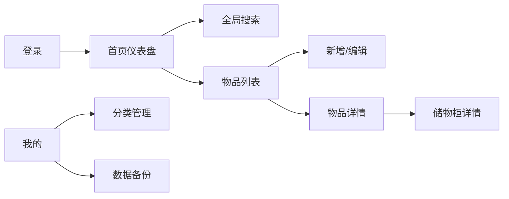
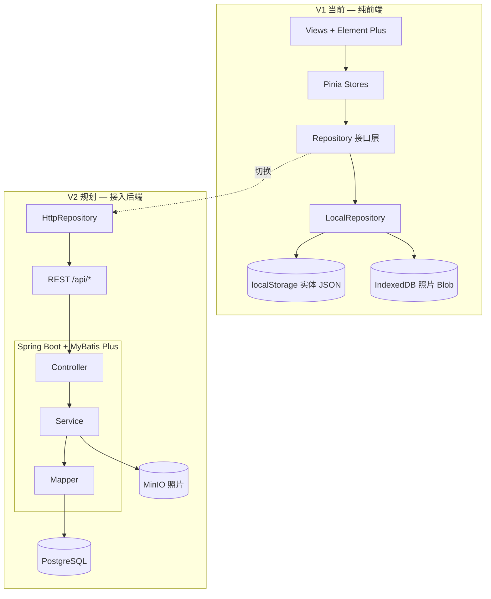
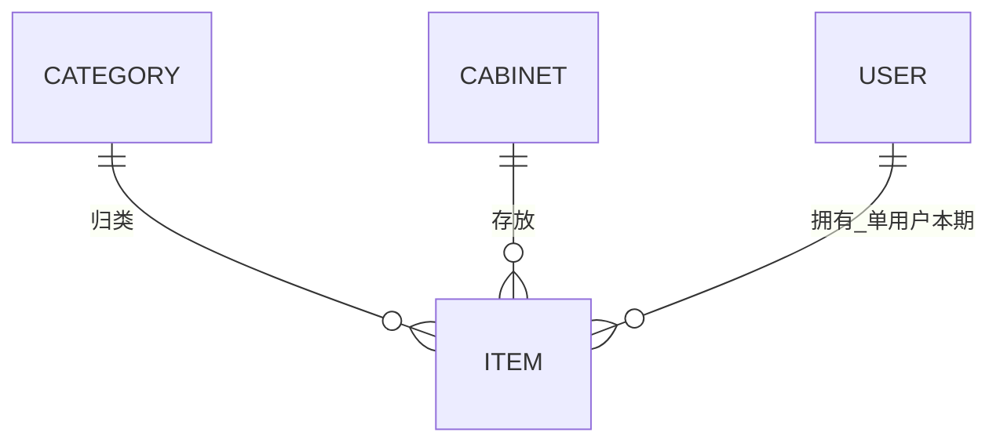

# 概要设计：物品收纳

> 基于《需求文档.md》及 `frontend/` 原型实现整理  
> 文档版本：1.1.0 | 更新日期：2026-05-26  
> **V1**：纯前端（Vue3 + TS + Element Plus），数据存 IndexedDB / localStorage  
> **V2**：接入 Spring Boot + MyBatis Plus + PostgreSQL（本文档已预留接口与工程结构）

---

## 第一章 需求分析

### 1.1 模块数量统计

本系统共 **5** 个核心业务模块：


| 序号  | 模块名称   | 类型     | 说明               |
| --- | ------ | ------ | ---------------- |
| M1  | 物品管理   | 增删改查类  | 物品 CRUD、照片、筛选    |
| M2  | 储物柜管理  | 增删改查类  | 储物柜 CRUD、关联物品展示  |
| M3  | 分类管理   | 增删改查类  | 分类 CRUD、排序、关联处理  |
| M4  | 搜索与仪表盘 | 非增删改查类 | 全局搜索、首页统计、时间快捷筛选 |
| M5  | 用户与系统  | 非增删改查类 | 演示登录、备份导入导出、缓存清理 |


**页面数量**：14 个（含登录页），底部 Tab 4 个：首页、物品、储物柜、我的。

### 1.2 功能需求清单

#### M1 物品管理


| 功能   | 类型  | 输入                         | 输出        | 业务规则                                    |
| ---- | --- | -------------------------- | --------- | --------------------------------------- |
| 创建物品 | C   | 名称、分类ID、照片≤3、存放日期、储物柜ID、备注 | 物品记录      | R001 名称 2-50 字；R010 默认今天；R006/R007 照片限制 |
| 查询列表 | R   | 关键字、分类、时间区间                | 分页/虚拟滚动列表 | 默认按 createdAt 倒序                        |
| 编辑物品 | U   | 同创建                        | 更新记录      | R011 变更储物柜时级联更新数量                       |
| 删除物品 | D   | 物品ID                       | 删除成功      | 二次确认；R012 储物柜计数 -1                      |
| 物品详情 | R   | 物品ID                       | 详情+轮播     | 可跳转储物柜详情                                |


#### M2 储物柜管理


| 功能    | 类型  | 输入           | 输出        | 业务规则                     |
| ----- | --- | ------------ | --------- | ------------------------ |
| 创建储物柜 | C   | 名称、照片≤3、位置描述 | 储物柜记录     | R002 名称 2-30 字；R005 名称唯一 |
| 查询列表  | R   | 关键字、创建时间区间   | 列表+物品数量角标 | 关键字匹配名称/位置               |
| 编辑/删除 | U/D | 表单/ID        | 更新/删除     | R008 有物品时禁止删除            |
| 柜内物品  | R   | 储物柜ID        | 关联物品列表    | 一对多：一件物品仅属一柜             |


#### M3 分类管理


| 功能      | 类型      | 输入        | 输出   | 业务规则                     |
| ------- | ------- | --------- | ---- | ------------------------ |
| CRUD 分类 | C/R/U/D | 名称、排序     | 分类列表 | R003/R004；R009 删除时处理关联物品 |
| 拖拽排序    | U       | sortOrder | 更新顺序 | 影响首页卡片顺序                 |


#### M4 搜索与仪表盘


| 功能     | 类型    | 说明                             |
| ------ | ----- | ------------------------------ |
| 首页仪表盘  | 非CRUD | 分类统计卡片、最近新增、储物柜入口              |
| 全局搜索   | 非CRUD | 防抖 300ms；物品/储物柜 Tab；R013 匹配优先级 |
| 时间快捷筛选 | 非CRUD | 今天/本周/本月/自定义闭区间 R014           |


#### M5 用户与系统


| 功能   | 类型    | 说明                                                       |
| ---- | ----- | -------------------------------------------------------- |
| 演示登录 | 非CRUD | [admin@example.com](mailto:admin@example.com) / password |
| 数据备份 | 非CRUD | JSON 导出/导入；R016-R019                                     |
| 清除缓存 | 非CRUD | 清空本地数据，二次确认                                              |


### 1.3 页面与路由（原型已实现）


| 页面             | 路由                      | Tab/层级  |
| -------------- | ----------------------- | ------- |
| 登录             | `/login`                | 独立      |
| 首页             | `/home`                 | Tab-首页  |
| 搜索             | `/search`               | 二级      |
| 物品列表/新增/详情/编辑  | `/items` 等              | Tab-物品  |
| 储物柜列表/新增/详情/编辑 | `/cabinets` 等           | Tab-储物柜 |
| 分类/备份          | `/categories`、`/backup` | 我的-二级   |
| 我的             | `/profile`              | Tab-我的  |


### 1.4 角色与权限

单角色 **家庭管理员**，登录后访问全部页面与操作（见需求文档第六章权限矩阵）。

### 1.5 码值设计


| 枚举类型                   | 中文名    | 枚举值                                 | 说明         | 使用位置      |
| ---------------------- | ------ | ----------------------------------- | ---------- | --------- |
| ItemLifecycleStatus    | 物品生命周期 | DRAFT, NORMAL, DELETED              | 草稿/正常/已删除  | 物品状态机     |
| CabinetLifecycleStatus | 储物柜状态  | NORMAL, HAS_ITEMS, DELETED          | 空柜/有物品/已删除 | 储物柜删除校验   |
| CategoryDeleteStrategy | 分类删除策略 | DELETE_ITEMS, MOVE_TO_UNCATEGORIZED | 一并删除/转至未分类 | 分类删除 R009 |
| BackupImportMode       | 备份导入模式 | MERGE, OVERWRITE                    | 合并/覆盖      | R018      |
| TimeFilterPreset       | 时间筛选预设 | TODAY, WEEK, MONTH, CUSTOM          | 快捷时间       | 列表筛选      |


### 1.6 交互设计规范（源自原型）


| 维度    | 规范                                                |
| ----- | ------------------------------------------------- |
| 布局    | 移动竖屏；状态栏+顶栏+滚动区+底 Tab；内容区 padding 16px；卡片圆角白底     |
| 底 Tab | 首页/物品/储物柜/我的；`el-tab-bar` 或自定义底栏 + Element Plus Icons |
| 触控    | 按钮最小 44×44px；字体最小 14px；`el-button` size="large" |
| 列表    | `el-card` 卡片列表；物品列表支持滑动操作 `el-swipe`（可选） |
| 表单    | `el-form` 分组 + `el-form-item` 校验；未保存 `ElMessageBox.confirm` |
| 照片    | `el-upload`；最多 3 张；压缩宽 1280px、≤500KB；`el-carousel` 预览 |
| 反馈    | `ElMessage` / `ElNotification`；删除 `ElMessageBox.confirm` |
| 搜索    | `el-input` + 防抖 300ms；结果 `el-tabs` 分物品/储物柜 |
| 主题    | Element Plus 默认主题 + 移动端 CSS 变量覆盖（主色、圆角、间距） |


### 1.7 场景与系统串联




**核心数据流**：分类、储物柜为独立主数据；物品通过 `category_id`、`cabinet_id` 关联；删除/迁移触发储物柜物品计数级联（R011/R012）。

### 1.8 隐藏功能与需求摘要

- **权限**：路由守卫 `requiresAuth`；未登录跳转 `/login`
- **校验**：前后端均需实现 R001-R009；照片 R006/R007
- **离线**：V1 全量本地（IndexedDB + localStorage），无网络亦可使用
- **扩展**：预留多用户、云端同步（V2）；通过 Repository 切换数据源

---

## 第二章 架构设计

### 2.1 调用 Apex Engineering 创建项目 Token


| 项        | 值                       |
| -------- | ----------------------- |
| 项目名称     | 家享收纳                    |
| 项目 token | `proj_be03b59f7b394a62` |
| 项目描述     | 家庭物品收纳管理移动端应用           |
| 创建时间     | 2026-05-26              |


### 2.2 顶层设计

#### 2.2.1 逻辑架构




#### 2.2.2 模块清单


| 模块     | 职责              | 边界           |
| ------ | --------------- | ------------ |
| 物品管理   | 物品 CRUD、筛选、照片   | 不管理储物柜/分类主数据 |
| 储物柜管理  | 储物柜 CRUD、柜内物品查询 | 不直接修改物品字段    |
| 分类管理   | 分类 CRUD、排序、删除策略 | 不实现物品表单      |
| 搜索与仪表盘 | 聚合查询与统计         | 只读其他模块数据     |
| 用户与系统  | 登录态、备份、缓存       | 不承载业务实体 CRUD |


#### 2.2.3 实体关系（逻辑）




- 物品 **N:1** 分类（单选）
- 物品 **N:1** 储物柜
- 本期单用户，无用户表权限细分

### 2.3 技术栈

#### 2.3.1 前端（目标栈 — Vue 3 + TypeScript + Element Plus）

| 类别 | 技术 | 说明 |
|------|------|------|
| 框架 | Vue 3 + TypeScript | 组合式 API + `<script setup lang="ts">` |
| UI | **Element Plus** | 表单、列表、弹窗、上传、消息反馈 |
| 图标 | `@element-plus/icons-vue` | 与 Element Plus 配套 |
| 路由 | Vue Router 4 | 路由守卫、懒加载 |
| 状态 | Pinia | 页面状态；**业务数据经 Repository 读写** |
| 构建 | Vite 5 | 开发/打包 |
| HTTP | axios | **V2** 启用；V1 仅封装预留 `request.ts` |
| 工具 | date-fns | 日期格式化 |

> **迁移说明**：当前 `frontend/` 原型使用 reka-ui + Tailwind，实施 V1 时逐步替换为 Element Plus，业务逻辑迁入 Repository，Store 不再直接操作 `localStorage`。

#### 2.3.2 V1 本地存储策略

| 数据类型 | 存储 | Key / Store 名 | 说明 |
|----------|------|----------------|------|
| 物品列表 | localStorage | `jiaxiang-items` | JSON 数组，与后端 `item` 字段对齐 |
| 储物柜列表 | localStorage | `jiaxiang-cabinets` | JSON 数组 |
| 分类列表 | localStorage | `jiaxiang-categories` | JSON 数组 |
| 登录态 | localStorage | `jiaxiang-auth` | token（V1 可为 mock 字符串） |
| 物品/柜照片 | **IndexedDB** | DB:`jiaxiang-db`，Store:`photos` | Blob/Base64；避免 localStorage 5MB 限制 |
| 配置 | localStorage | `jiaxiang-config` | `dataSource: 'local' \| 'remote'`（V2 切换） |

**读写统一入口**：`src/repositories/local/*Repository.ts`，禁止 View/Store 散落读写。

#### 2.3.3 后端（V2 规划 — Spring Boot + MyBatis Plus）

| 类别 | 技术 |
|------|------|
| 运行时 | JDK 8+ |
| 框架 | Spring Boot 2.7.x / 3.x |
| ORM | **MyBatis Plus**（默认代码生成：Entity、Mapper、Service） |
| 认证 | Spring Security + JWT |
| 数据库 | PostgreSQL |
| 连接池 | Druid |
| API 文档 | Knife4j |
| 对象存储 | MinIO（照片） |

**默认包结构**（`backend/`，V2 生成）：

```
backend/
├── pom.xml
└── src/main/java/com/thunisoft/homestorage/
    ├── HomeStorageApplication.java
    ├── common/          # Result、异常、常量
    ├── config/          # Security、MyBatis、Cors、MinIO
    ├── controller/      # ItemController、CabinetController…
    ├── service/         # 接口 + impl
    ├── mapper/          # BaseMapper 继承
    ├── entity/          # 与表结构一致 @TableName
    ├── dto/             # 入参
    └── vo/              # 出参
└── src/main/resources/
    ├── application.yml
    └── mapper/xml/      # 复杂 SQL（可选）
```

实体类与 `详细设计_核心数据模型.sql` 一一对应（`Item`、`Cabinet`、`Category`、`ItemPhoto` 等）。

### 2.4 版本演进与 Repository 预留口

#### 2.4.1 设计原则

- **面向接口编程**：Pinia Store / Composable 只依赖 `IItemRepository` 等接口，不感知本地或远程。
- **单一切换点**：`src/config/dataSource.ts` + 环境变量 `VITE_DATA_SOURCE=local|remote`。
- **DTO 对齐**：前端 `types/` 与后端 Entity/VO 字段名一致（camelCase），减少 V2 改造成本。

#### 2.4.2 Repository 接口清单（预留）

| 接口 | V1 实现 | V2 实现 |
|------|---------|---------|
| `IItemRepository` | `LocalItemRepository` | `HttpItemRepository` → `/api/items` |
| `ICabinetRepository` | `LocalCabinetRepository` | `HttpCabinetRepository` |
| `ICategoryRepository` | `LocalCategoryRepository` | `HttpCategoryRepository` |
| `IAuthRepository` | `LocalAuthRepository`（mock 登录） | `HttpAuthRepository` |
| `IBackupRepository` | `LocalBackupRepository`（JSON 文件） | `HttpBackupRepository` |
| `IPhotoRepository` | `IndexedDbPhotoRepository` | `HttpPhotoRepository` → MinIO |
| `IDashboardRepository` | `LocalDashboardRepository`（聚合计算） | `HttpDashboardRepository` |

#### 2.4.3 前端目录（V1 目标）

```
frontend/src/
├── api/                 # V2：axios 封装，与 Controller 路径一致
├── config/
│   ├── dataSource.ts    # local | remote
│   └── constants.ts
├── repositories/
│   ├── types.ts         # IItemRepository…
│   ├── index.ts         # getItemRepository() 工厂
│   ├── local/           # V1
│   └── http/            # V2 占位
├── types/               # Item、Cabinet、Category 与 SQL 对齐
├── stores/              # 调用 repository，不直接 localStorage
├── views/
├── components/
└── utils/
    ├── storage/localStorage.ts
    └── storage/indexedDB.ts
```

#### 2.4.4 切换至后端（V2）步骤

1. 部署 Spring Boot，执行 `详细设计_核心数据模型.sql`
2. 实现各 `*Controller`，响应格式 `Result<T>`（与详细设计一致）
3. 新增 `repositories/http/*`，复用 `api/request.ts`（JWT 拦截器）
4. 配置 `VITE_DATA_SOURCE=remote`、`VITE_API_BASE_URL`
5. 数据迁移：备份 JSON 导入接口或一次性迁移脚本

### 2.5 部署形态

| 版本 | 部署 |
|------|------|
| V1 | 纯静态资源（Vite build），无后端依赖 |
| V2 | 前端 Nginx + 后端 Jar + PostgreSQL + MinIO |

---

## 附录

### A. 与需求文档差异说明


| 项 | 需求文档 | V1 决策 | V2 决策 |
|----|----------|---------|---------|
| 数据存储 | 最终服务端 DB | IndexedDB + localStorage | PostgreSQL + MinIO |
| UI | 移动端 | Element Plus | 不变 |
| 后端 | 接口交互 | **无后端** | Spring Boot + MyBatis Plus |
| 离线 | 支持离线 | 全功能本地可用 | API + 可选 PWA 缓存 |

### B. 详细设计文档规范

所有 `详细设计_*.md` **统一参照** `详细设计_物品管理.md` 结构：

1. 模块概述（含 Repository 接口与 V1/V2 实现路径）  
2. 表结构 / 数据依赖  
3. V1 前端实现（`I*Repository` 方法表）  
4. V2 后端（Service + Entity + Mapper）  
5. API（**Repository 方法 ↔ HTTP 一一映射**）  
6. 类图  
7. UI/UX（Element Plus）  
8. **功能清单 — V1/V2 对接映射**  
9. 业务规则映射  

### C. 后续步骤

1. 按 `详细设计_前端数据访问层.md` 实现 Repository + 本地存储  
2. 页面迁移至 Element Plus，Store 改为调用 Repository  
3. V2：生成 `backend/` 工程，按各文档 §5 API 表实现 Controller，将 `VITE_DATA_SOURCE` 改为 `remote`

