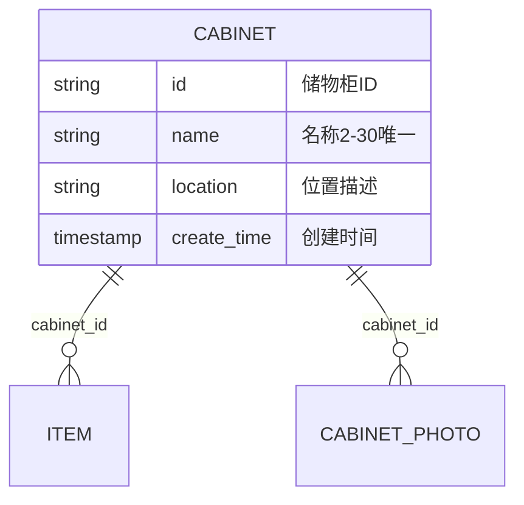
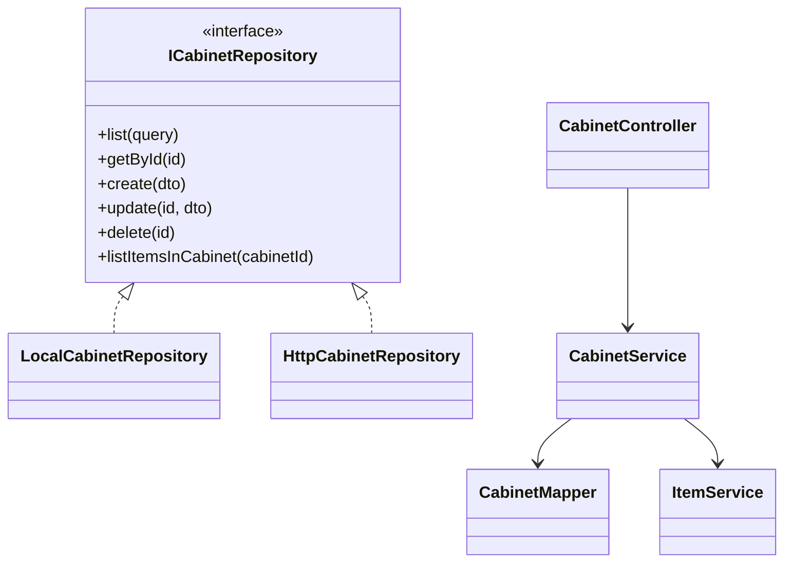

# 详细设计 — 储物柜管理

> 依据《概要设计.md》M2 模块  
> **V1**：`LocalCabinetRepository` + localStorage / IndexedDB（照片）  
> **V2**：Spring Boot `CabinetController` + MyBatis Plus `CabinetMapper`  
> 数据访问层详见 `详细设计_前端数据访问层.md` | 表结构：`详细设计_核心数据模型.sql`

---

## 1. 模块概述

| 项 | 说明 |
|----|------|
| 职责 | 储物柜 CRUD、列表筛选、柜内物品展示、删除前空柜校验 |
| 边界 | 物品增删由物品模块负责；本模块只读关联物品 |
| 原型页面 | `Cabinets.vue`、`CabinetForm.vue`、`CabinetDetail.vue` |
| Store | `frontend/src/stores/cabinets.ts` |
| Repository 接口 | `ICabinetRepository` |
| V1 实现 | `repositories/local/cabinetRepository.ts` |
| V2 实现 | `repositories/http/cabinetRepository.ts` → `api/cabinets.ts` |

---

## 2. 表结构设计（V2 落库，V1 内存结构对齐）

核心表：`cabinet`、`cabinet_photo`（见核心 SQL）。



**物品数量**：V2 用 `COUNT(item)` 实时统计，不冗余字段（V1 调 `IItemRepository` 统计）。

---

## 3. V1 前端实现（无后端）

### 3.1 实现要点

| 项 | 说明 |
|----|------|
| Repository | `LocalCabinetRepository` 实现 `ICabinetRepository` |
| 实体存储 | `STORAGE_KEYS.CABINETS` |
| 照片存储 | `IndexedDbPhotoRepository`（scope=`cabinet`） |
| Store | `getCabinetRepository()` |
| UI | `el-card`、`el-form`、`el-upload`、`el-empty` |

### 3.2 `ICabinetRepository` 接口（V1/V2 共用签名）

| 方法 | 参数 | 返回 | V1 行为 |
|------|------|------|---------|
| `list` | `CabinetQuery` | `PageResult<Cabinet>` | 关键字过滤 name/location；按 createTime 倒序 |
| `getById` | `id` | `Cabinet \| null` | 含 `itemCount`（调 ItemRepo 统计） |
| `create` | `CabinetCreateInput` | `string` | UUID；R002/R005 校验 |
| `update` | `id`, `Partial<Cabinet>` | `void` | |
| `delete` | `id` | `void` | R008：itemCount>0 抛错 |
| `listItemsInCabinet` | `cabinetId` | `ItemBrief[]` | 调 `IItemRepository.list({ cabinetId })` |
| `uploadPhoto` | `id`, `file`, `index` | `string` | IndexedDB |
| `deletePhoto` | `id`, `index` | `void` | |

### 3.3 前端类型

```typescript
export interface Cabinet {
  id: string
  name: string
  photos: string[]
  location: string
  createdAt: string
}

export interface CabinetVO extends Cabinet {
  itemCount: number
}
```

---

## 4. V2 后端设计（MyBatis Plus）

### 4.1 Service 接口

包路径：`com.thunisoft.homestorage.service.CabinetService`  
实现类：`CabinetServiceImpl extends ServiceImpl<CabinetMapper, Cabinet>`

| 方法 | 参数 | 返回 | 说明 |
|------|------|------|------|
| `createCabinet` | `CabinetCreateDTO` | `String` | R002、R005 |
| `updateCabinet` | `id`, `CabinetUpdateDTO` | `void` | |
| `deleteCabinet` | `id` | `void` | R008：count>0 → 409 |
| `getCabinetById` | `id` | `CabinetVO` | itemCount + photos |
| `listCabinets` | `CabinetQueryDTO` | `Page<CabinetListVO>` | |
| `listItemsInCabinet` | `cabinetId` | `List<ItemBriefVO>` | |
| `getItemCount` | `cabinetId` | `int` | 物品模块 R011 调用 |

**CabinetQueryDTO**：`keyword`, `createTimeStart`, `createTimeEnd`, `current`, `size`

### 4.2 实体类

```java
@TableName("cabinet")
public class Cabinet {
    @TableId(type = IdType.ASSIGN_UUID)
    private String id;
    private String name;
    private String location;
    private LocalDateTime createTime;
    private LocalDateTime updateTime;
    @TableLogic
    private Boolean deleted;
}
```

```java
@TableName("cabinet_photo")
public class CabinetPhoto {
    @TableId(type = IdType.ASSIGN_UUID)
    private String id;
    private String cabinetId;
    private String fileUrl;
    private Integer sortOrder;
    private LocalDateTime createTime;
}
```

### 4.3 Mapper

`CabinetMapper extends BaseMapper<Cabinet>`

---

## 5. API 接口设计（REST，V2 启用）

| Repository 方法 | HTTP | 路径 | 说明 |
|-----------------|------|------|------|
| `list` | GET | `/api/cabinets` | 分页 + 筛选 |
| `getById` | GET | `/api/cabinets/{id}` | 含 itemCount |
| `create` | POST | `/api/cabinets` | |
| `update` | PUT | `/api/cabinets/{id}` | |
| `delete` | DELETE | `/api/cabinets/{id}` | 409 非空柜 |
| `listItemsInCabinet` | GET | `/api/cabinets/{id}/items` | |
| `uploadPhoto` | POST | `/api/cabinets/{id}/photos` | multipart |
| `deletePhoto` | DELETE | `/api/cabinets/{id}/photos/{index}` | |

**非空柜删除错误**：

```json
{
  "code": 409,
  "message": "该储物柜下还有物品，请先移出后再删除",
  "data": null
}
```

**前端封装**：`frontend/src/api/cabinets.ts` + `HttpCabinetRepository`。

---

## 6. 类图设计



---

## 7. UI/UX 设计（Element Plus）

| 页面 | 组件 | 数据调用 |
|------|------|----------|
| 列表 | `el-card`、`el-badge`（物品数）、`el-input` 搜索 | `repo.list` |
| 表单 | `el-input`、`el-input type=textarea`、`el-upload` | `create`/`update` |
| 详情 | `el-carousel`、物品 `el-card` 列表、`el-button danger` | `getById`、`listItemsInCabinet` |

删除：`ElMessageBox.confirm`；有物品时按钮 `disabled` + 提示（R008）。

---

## 8. 功能清单 — V1/V2 对接映射

| 功能 | V1 | V2 API | HttpRepository |
|------|----|--------|----------------|
| 储物柜列表 | `list` 内存筛选 | `GET /api/cabinets` | `list` |
| 储物柜详情 | `getById` + 统计物品 | `GET /api/cabinets/{id}` | `getById` |
| 新增储物柜 | `create` | `POST /api/cabinets` | `create` |
| 编辑储物柜 | `update` | `PUT /api/cabinets/{id}` | `update` |
| 删除储物柜 | `delete`（空柜校验） | `DELETE /api/cabinets/{id}` | `delete` |
| 柜内物品列表 | `listItemsInCabinet` | `GET .../items` | 同名 |
| 照片上传/删 | IndexedDB | `POST/DELETE .../photos` | `uploadPhoto`/`deletePhoto` |
| 列表物品角标 | ItemRepo.count | SQL COUNT | 后端返回 |

---

## 9. 与概要设计规则映射

| 规则 | V1 | V2 |
|------|----|----|
| R002/R005 | Repository 校验 | Service + DB 唯一索引 |
| R008 | delete 前 `getItemCount` | Service 抛 409 |
