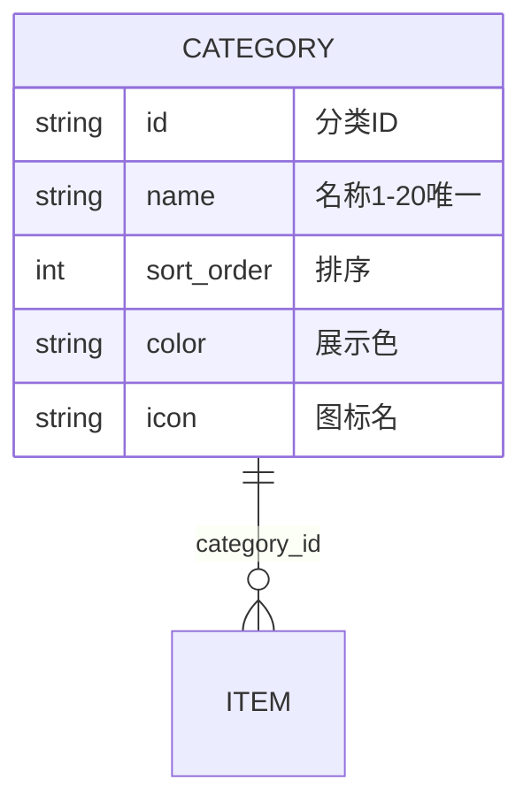
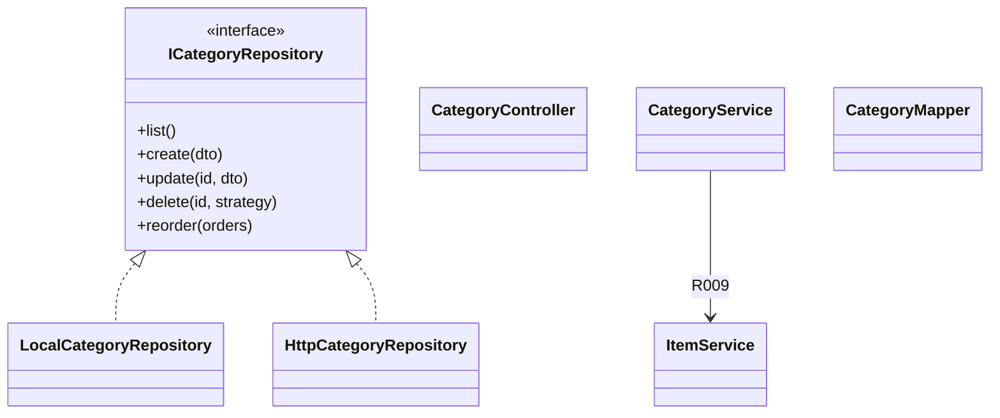

# 详细设计 — 分类管理

> 依据《概要设计.md》M3 模块  
> **V1**：`LocalCategoryRepository` + localStorage  
> **V2**：Spring Boot `CategoryController` + MyBatis Plus `CategoryMapper`  
> 数据访问层详见 `详细设计_前端数据访问层.md` | 表结构：`详细设计_核心数据模型.sql`

---

## 1. 模块概述

| 项 | 说明 |
|----|------|
| 职责 | 分类 CRUD、拖拽排序、删除时关联物品处理 |
| 边界 | 不编辑物品表单；删除时协调 `IItemRepository` |
| 原型页面 | `Categories.vue` |
| Store | `frontend/src/stores/categories.ts` |
| Repository 接口 | `ICategoryRepository` |
| V1 实现 | `repositories/local/categoryRepository.ts` |
| V2 实现 | `repositories/http/categoryRepository.ts` → `api/categories.ts` |

---

## 2. 表结构设计（V2 落库，V1 内存结构对齐）

表：`category`（见核心 SQL）。



**未分类（R009）**：保留 `cat-uncategorized` 或 V2 预置「未分类」记录。

---

## 3. V1 前端实现（无后端）

### 3.1 实现要点

| 项 | 说明 |
|----|------|
| Repository | `LocalCategoryRepository` |
| 存储 | `STORAGE_KEYS.CATEGORIES` |
| Store | `getCategoryRepository()` |
| UI | `el-table` / 可拖拽列表、`el-input` 底部新增 |

### 3.2 `ICategoryRepository` 接口（V1/V2 共用签名）

| 方法 | 参数 | 返回 | V1 行为 |
|------|------|------|---------|
| `list` | — | `Category[]` | 按 `sortOrder` 升序；附带 `itemCount` |
| `getById` | `id` | `Category \| null` | |
| `create` | `{ name, color?, icon? }` | `string` | R003/R004 |
| `update` | `id`, `Partial<Category>` | `void` | |
| `delete` | `id`, `strategy` | `void` | R009：删物品或改未分类 |
| `reorder` | `{ id, sortOrder }[]` | `void` | 批量写回 |
| `getItemCount` | `categoryId` | `number` | 调 ItemRepo |

### 3.3 前端类型

```typescript
export interface Category {
  id: string
  name: string
  sortOrder: number
  createdAt: string
  color?: string
  icon?: string
}

export type CategoryDeleteStrategy = 'DELETE_ITEMS' | 'MOVE_TO_UNCATEGORIZED'
```

---

## 4. V2 后端设计（MyBatis Plus）

### 4.1 Service 接口

包路径：`com.thunisoft.homestorage.service.CategoryService`  
实现类：`CategoryServiceImpl extends ServiceImpl<CategoryMapper, Category>`

| 方法 | 参数 | 返回 | 说明 |
|------|------|------|------|
| `createCategory` | `CategoryCreateDTO` | `String` | R003/R004 |
| `updateCategory` | `id`, `CategoryUpdateDTO` | `void` | |
| `deleteCategory` | `id`, `CategoryDeleteStrategy` | `void` | R009 事务处理物品 |
| `listCategories` | — | `List<CategoryVO>` | 含 itemCount |
| `reorderCategories` | `List<CategoryOrderDTO>` | `void` | 批量更新 sort_order |

### 4.2 实体类

```java
@TableName("category")
public class Category {
    @TableId(type = IdType.ASSIGN_UUID)
    private String id;
    private String name;
    private Integer sortOrder;
    private String color;
    private String icon;
    private LocalDateTime createTime;
    private LocalDateTime updateTime;
    @TableLogic
    private Boolean deleted;
}
```

### 4.3 Mapper

`CategoryMapper extends BaseMapper<Category>`；`uk_category_name` 唯一（见 SQL）。

---

## 5. API 接口设计（REST，V2 启用）

| Repository 方法 | HTTP | 路径 | 说明 |
|-----------------|------|------|------|
| `list` | GET | `/api/categories` | 全量（不分页） |
| `getById` | GET | `/api/categories/{id}` | 可选 |
| `create` | POST | `/api/categories` | body: name, color?, icon? |
| `update` | PUT | `/api/categories/{id}` | |
| `delete` | DELETE | `/api/categories/{id}` | query: `strategy` |
| `reorder` | PUT | `/api/categories/reorder` | body: `[{id, sortOrder}]` |

**删除确认**：`ElMessageBox` + `el-radio-group` 选择 strategy。

**前端封装**：`frontend/src/api/categories.ts` + `HttpCategoryRepository`。

---

## 6. 类图设计



---

## 7. UI/UX 设计（Element Plus）

| 页面 | 组件 | 数据调用 |
|------|------|----------|
| 分类管理 | `el-table`、拖拽、`el-button` | `list`、`reorder`、`delete` |
| 底部新增 | `el-input` + `el-button` | `create` |
| 首页卡片 | `el-scrollbar` 横滑 | `list`；跳转带 `categoryId` |

---

## 8. 功能清单 — V1/V2 对接映射

| 功能 | V1 | V2 API | HttpRepository |
|------|----|--------|----------------|
| 分类列表 | `list` | `GET /api/categories` | `list` |
| 新增分类 | `create` | `POST /api/categories` | `create` |
| 编辑分类 | `update` | `PUT /api/categories/{id}` | `update` |
| 删除分类 | `delete(id, strategy)` | `DELETE ...?strategy=` | `delete` |
| 拖拽排序 | `reorder` | `PUT /api/categories/reorder` | `reorder` |
| 物品数量展示 | ItemRepo 统计 | 后端 itemCount | VO 字段 |
| 首页分类卡片 | 同 `list` | 同左 | 无页面改动 |

---

## 9. 与概要设计规则映射

| 规则 | V1 | V2 |
|------|----|----|
| R003/R004 | Repository 校验 | Service + 唯一索引 |
| R009 | delete 分支调 ItemRepo | Service 事务 |
| R015 | 首次 `list` 空则种子数据 | Flyway/初始化 SQL |
