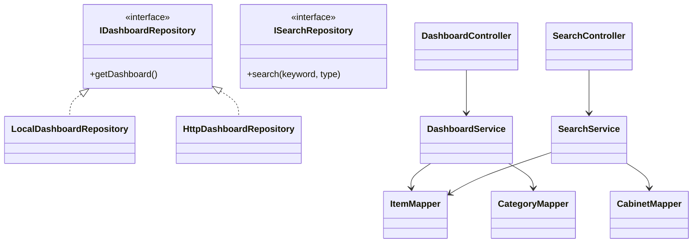
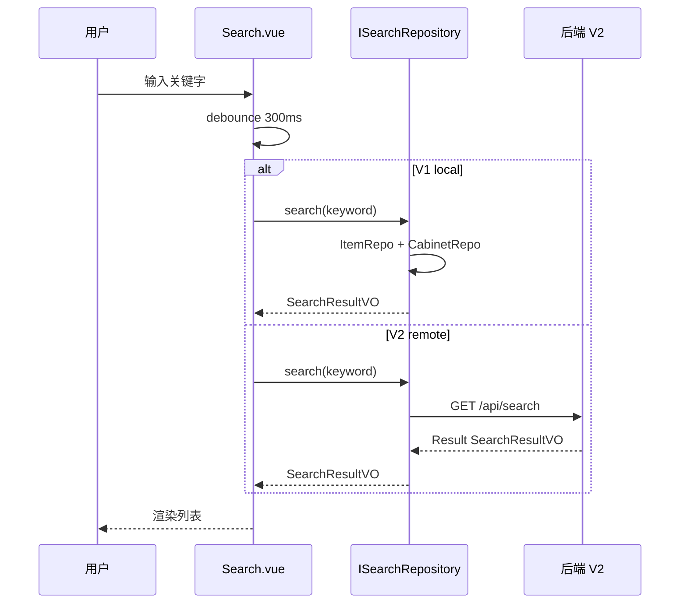

# 详细设计 — 搜索与仪表盘

> 依据《概要设计.md》M4 模块  
> **V1**：`LocalDashboardRepository` + `LocalSearchRepository`（聚合各 Local Repository）  
> **V2**：`DashboardController` + `SearchController`  
> 数据访问层详见 `详细设计_前端数据访问层.md` | 无独立表，复用 item/cabinet/category

---

## 1. 模块概述

| 项 | 说明 |
|----|------|
| 职责 | 首页统计、最近新增、全局跨实体搜索、时间快捷筛选 |
| 类型 | 非增删改查 — 只读聚合 |
| 原型页面 | `Home.vue`、`Search.vue` |
| Repository 接口 | `IDashboardRepository`、`ISearchRepository` |
| V1 实现 | `repositories/local/dashboardRepository.ts`、`searchRepository.ts` |
| V2 实现 | `repositories/http/dashboardRepository.ts`、`searchRepository.ts` |

---

## 2. 数据依赖（无独立表）

| 依赖实体 | 来源表 | V1 来源 | V2 来源 |
|----------|--------|---------|---------|
| 分类统计 | `category` + `item` | CategoryRepo + ItemRepo | `DashboardService` SQL 聚合 |
| 最近物品 | `item` | ItemRepo 排序取 5 | 同上 |
| 储物柜摘要 | `cabinet` + `item` | CabinetRepo + count | 同上 |
| 搜索结果-物品 | `item` | ItemRepo.list({ keyword }) | `SearchService` |
| 搜索结果-柜 | `cabinet` | CabinetRepo.list({ keyword }) | 同上 |

---

## 3. V1 前端实现（无后端）

### 3.1 实现要点

| 项 | 说明 |
|----|------|
| 仪表盘 | `LocalDashboardRepository.getDashboard()` |
| 搜索 | `LocalSearchRepository.search(keyword, type)` |
| 防抖 | `useDebounceFn` 300ms（`Search.vue`） |
| UI | `el-input`、`el-tabs`、`el-card`、`el-scrollbar` |

### 3.2 `IDashboardRepository` 接口

| 方法 | 返回 | V1 行为 |
|------|------|---------|
| `getDashboard` | `DashboardVO` | 并行拉分类/物品/柜；内存聚合 |

```typescript
export interface DashboardVO {
  categoryStats: { categoryId: string; name: string; count: number; color?: string; icon?: string }[]
  recentItems: ItemBrief[]
  cabinetSummary: { id: string; name: string; itemCount: number }[]
  totalItems: number
  totalCabinets: number
}
```

### 3.3 `ISearchRepository` 接口

| 方法 | 参数 | 返回 | V1 行为 |
|------|------|------|---------|
| `search` | `keyword`, `type?: 'all'\|'item'\|'cabinet'` | `SearchResultVO` | 并行 list；R013 排序 |

```typescript
export interface SearchResultVO {
  items: ItemBrief[]
  cabinets: CabinetBrief[]
}
```

---

## 4. V2 后端设计（MyBatis Plus）

### 4.1 Service 接口

**DashboardService**（只读，无独立 Mapper 表）

| 方法 | 返回 | 说明 |
|------|------|------|
| `getDashboard` | `DashboardVO` | 一次聚合查询或多次调用 Item/Category/Cabinet Service |
| `getCategoryStats` | `List<CategoryStatVO>` | 各分类 COUNT(item) |

**SearchService**

| 方法 | 参数 | 返回 | 说明 |
|------|------|------|------|
| `globalSearch` | `keyword`, `type`, `current`, `size` | `SearchResultVO` 或分页 | R013 名称优先 |

### 4.2 实体类

本模块无独立 Entity；DTO/VO 如下：

```java
public class DashboardVO { /* 字段同前端 DashboardVO */ }
public class SearchResultVO {
    private List<ItemBriefVO> items;
    private List<CabinetBriefVO> cabinets;
}
```

### 4.3 Mapper

- 可在 `ItemMapper`/`CabinetMapper` 增加 `@Select` 搜索 SQL
- 或 `SearchMapper.xml` 专用模糊查询

---

## 5. API 接口设计（REST，V2 启用）

| Repository 方法 | HTTP | 路径 | 说明 |
|-----------------|------|------|------|
| `getDashboard` | GET | `/api/dashboard` | 首页一次性加载 |
| `search` (all) | GET | `/api/search` | query: keyword, type, current, size |
| `search` (items) | GET | `/api/search` | type=item |
| `search` (cabinets) | GET | `/api/search` | type=cabinet |

**搜索成功示例**：

```json
{
  "code": 200,
  "message": "success",
  "data": {
    "items": [{ "id": "item-2", "name": "螺丝刀套装", "cabinetName": "阳台工具箱" }],
    "cabinets": []
  }
}
```

**前端封装**：`api/dashboard.ts`、`api/search.ts` + `HttpDashboardRepository`、`HttpSearchRepository`。

---

## 6. 类图设计



---

## 7. UI/UX 设计（Element Plus）

### 7.1 首页 `Home.vue`

| 区块 | 组件 | 调用 |
|------|------|------|
| 顶栏搜索 | `el-input` readonly → 跳转 | — |
| 分类横滑 | `el-scrollbar` + `el-card` | `getDashboard().categoryStats` |
| 最近新增 | `el-card` 列表 | `recentItems` |
| 储物柜入口 | `el-button` / `el-card` | `cabinetSummary` |
| 下拉刷新 | — | 重新 `getDashboard()` |

### 7.2 搜索页 `Search.vue`

| 元素 | 组件 | 调用 |
|------|------|------|
| 输入 | `el-input` debounce 300ms | `search(keyword, tabType)` |
| Tab | `el-tabs` | type=all/item/cabinet |
| 结果 | `el-empty` / 列表项 | `SearchResultVO` |

---

## 8. 功能清单 — V1/V2 对接映射

| 功能 | V1 | V2 API | HttpRepository |
|------|----|--------|----------------|
| 首页仪表盘 | `getDashboard()` 内存聚合 | `GET /api/dashboard` | `HttpDashboardRepository` |
| 分类统计卡片 | categoryStats | 后端聚合 | 字段一致 |
| 最近 5 件物品 | recentItems | 同上 | 同上 |
| 全局搜索 | `search(kw,'all')` | `GET /api/search` | `HttpSearchRepository` |
| 仅搜物品 Tab | type=item | query type | 同上 |
| 仅搜储物柜 Tab | type=cabinet | query type | 同上 |
| 跳转物品详情 | router | 不变 | 不变 |
| 时间快捷筛选 | 列表页 query 透传 ItemRepo | Item API query | 物品模块 |

---

## 9. 与概要设计规则映射

| 规则 | V1 | V2 |
|------|----|----|
| R013 | search 内名称优先排序 | Service/SQL score |
| R014 | 列表页日期筛选走 Item/Cabinet Repo | query 透传 REST |

---

## 10. 时序图 — 全局搜索（V1 / V2 对比）


