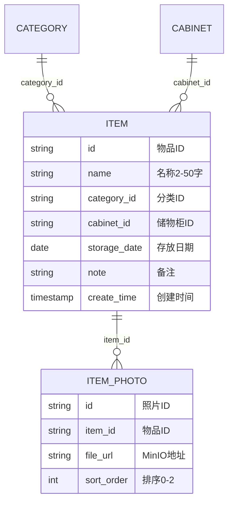
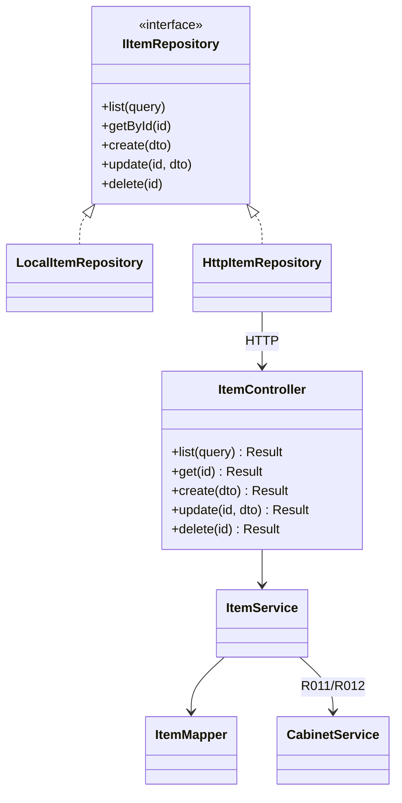

# 详细设计 — 物品管理

> 依据《概要设计.md》M1 模块  
> **V1**：`LocalItemRepository` + localStorage / IndexedDB（照片）  
> **V2**：Spring Boot `ItemController` + MyBatis Plus `ItemMapper`  
> 数据访问层详见 `详细设计_前端数据访问层.md` | 表结构：`详细设计_核心数据模型.sql`

---

## 1. 模块概述

| 项 | 说明 |
|----|------|
| 职责 | 物品全生命周期 CRUD、列表筛选、照片管理 |
| 边界 | 不维护分类/储物柜主数据，仅引用 ID |
| 原型页面 | `Items.vue`、`ItemForm.vue`、`ItemDetail.vue` |
| Store | `frontend/src/stores/items.ts` |
| Repository 接口 | `IItemRepository` |
| V1 实现 | `repositories/local/itemRepository.ts` |
| V2 实现 | `repositories/http/itemRepository.ts` → `api/items.ts` |

---

## 2. 表结构设计（V2 落库，V1 内存结构对齐）

核心表：`item`、`item_photo`（见 `详细设计_核心数据模型.sql`）。



**业务约束**：逻辑外键；建议 `deleted` 逻辑删除（V2 `@TableLogic`）。

---

## 3. V1 前端实现（无后端）

### 3.1 实现要点

| 项 | 说明 |
|----|------|
| Repository | `LocalItemRepository` 实现 `IItemRepository` |
| 实体存储 | `STORAGE_KEYS.ITEMS`（localStorage JSON） |
| 照片存储 | `IndexedDbPhotoRepository`（`jiaxiang-db` / `photos`） |
| Store | 仅调用 `getItemRepository()`，禁止直接 `localStorage` |
| UI | Element Plus：`el-card`、`el-form`、`el-upload`、`el-carousel` |

### 3.2 `IItemRepository` 接口（V1/V2 共用签名）

| 方法 | 参数 | 返回 | V1 行为 |
|------|------|------|---------|
| `list` | `ItemQuery` | `PageResult<Item>` | 内存过滤 + 分页 |
| `getById` | `id` | `Item \| null` | 数组查找 |
| `create` | `ItemCreateInput` | `string`（id） | UUID；写 localStorage |
| `update` | `id`, `Partial<Item>` | `void` | 合并；cabinetId 变更触发 R011 |
| `delete` | `id` | `void` | 过滤删除；清照片；R012 |
| `uploadPhoto` | `id`, `file`, `index` | `string`（url） | IndexedDB + 更新 photos[] |
| `deletePhoto` | `id`, `index` | `void` | IndexedDB 删除 |

**照片 URL（V1）**：返回 `blob:` ObjectURL 或内部 key，`el-image` 展示。

### 3.3 前端类型（与 Entity 字段对齐）

```typescript
export interface Item {
  id: string
  name: string
  categoryId: string
  cabinetId: string
  photos: string[]
  storageDate: string
  note: string
  createdAt: string
}
```

---

## 4. V2 后端设计（MyBatis Plus）

### 4.1 Service 接口

包路径：`com.thunisoft.homestorage.service.ItemService`  
实现类：`ItemServiceImpl extends ServiceImpl<ItemMapper, Item>`

| 方法 | 参数 | 返回 | 说明 |
|------|------|------|------|
| `createItem` | `ItemCreateDTO` | `String` id | R001；R010 默认今天；写 `item_photo` |
| `updateItem` | `id`, `ItemUpdateDTO` | `void` | R011 变更 cabinetId |
| `deleteItem` | `id` | `void` | R012；删照片 |
| `getItemById` | `id` | `ItemVO` | 含分类名、储物柜名、照片 URL |
| `listItems` | `ItemQueryDTO` | `Page<ItemListVO>` | 分页筛选 |
| `countByCabinetId` | `cabinetId` | `int` | 储物柜模块调用 |

**ItemQueryDTO**：`keyword`, `categoryId`, `storageDateStart`, `storageDateEnd`, `createTimeStart`, `createTimeEnd`, `current`, `size`

### 4.2 实体类

```java
@TableName("item")
public class Item {
    @TableId(type = IdType.ASSIGN_UUID)
    private String id;
    private String name;
    private String categoryId;
    private String cabinetId;
    private LocalDate storageDate;
    private String note;
    private LocalDateTime createTime;
    private LocalDateTime updateTime;
    @TableLogic
    private Boolean deleted;
}
```

```java
@TableName("item_photo")
public class ItemPhoto {
    @TableId(type = IdType.ASSIGN_UUID)
    private String id;
    private String itemId;
    private String fileUrl;
    private Integer sortOrder;
    private LocalDateTime createTime;
}
```

### 4.3 Mapper

`ItemMapper extends BaseMapper<Item>`；复杂筛选可用 XML 或 `LambdaQueryWrapper`。

---

## 5. API 接口设计（REST，V2 启用）

统一前缀 `/api/items`，响应 `Result<T>`。`HttpItemRepository` **方法一一映射**下表。

| Repository 方法 | HTTP | 路径 | 说明 |
|-----------------|------|------|------|
| `list` | GET | `/api/items` | query 同 ItemQueryDTO |
| `getById` | GET | `/api/items/{id}` | |
| `create` | POST | `/api/items` | body: ItemCreateDTO |
| `update` | PUT | `/api/items/{id}` | body: ItemUpdateDTO |
| `delete` | DELETE | `/api/items/{id}` | |
| `uploadPhoto` | POST | `/api/items/{id}/photos` | multipart，`index` query |
| `deletePhoto` | DELETE | `/api/items/{id}/photos/{index}` | |

**列表成功响应**：

```json
{
  "code": 200,
  "message": "success",
  "data": {
    "records": [
      {
        "id": "item-1",
        "name": "冬季羽绒服",
        "categoryName": "衣物",
        "cabinetName": "主卧衣柜",
        "storageDate": "2025-11-01",
        "coverPhoto": "/minio/items/item-1-1.jpg"
      }
    ],
    "total": 10,
    "size": 10,
    "current": 1,
    "pages": 1
  }
}
```

**前端封装**：`frontend/src/api/items.ts`（axios）；`HttpItemRepository` 解包 `Result.data`。

---

## 6. 类图设计



---

## 7. UI/UX 设计（Element Plus）

| 页面 | 组件 | 数据调用 |
|------|------|----------|
| 列表 `Items.vue` | `el-card`、`el-input`、`el-select`、`el-date-picker` | `repo.list(query)` |
| 表单 `ItemForm.vue` | `el-form`、`el-upload`、`el-date-picker` | `create` / `update` |
| 详情 `ItemDetail.vue` | `el-carousel`、`el-descriptions` | `getById`；跳转储物柜 |

V1/V2 页面代码相同，仅 Repository 实现切换。

---

## 8. 功能清单 — V1/V2 对接映射

| 功能 | V1 实现 | V2 后端 | V2 前端切换 |
|------|---------|---------|-------------|
| 物品列表 | `LocalItemRepository.list` | `GET /api/items` | `HttpItemRepository.list` |
| 物品详情 | `getById` | `GET /api/items/{id}` | 同上 |
| 新增物品 | `create` + localStorage | `POST /api/items` | 同上 |
| 编辑物品 | `update` | `PUT /api/items/{id}` | 同上 |
| 删除物品 | `delete` | `DELETE /api/items/{id}` | 同上 |
| 上传照片 | `IndexedDbPhotoRepository` | `POST .../photos` → MinIO | `uploadPhoto` |
| 删除照片 | IndexedDB 删除 | `DELETE .../photos/{index}` | `deletePhoto` |
| 分类筛选 | query.categoryId 内存过滤 | query 透传 | 无改动 |
| 时间筛选 | 内存比较日期 | SQL 条件 | 无改动 |
| 左滑删除 | 调 `repo.delete` | 同上 | 无改动 |

**切换条件**：`VITE_DATA_SOURCE=remote` → 工厂返回 `HttpItemRepository`。

---

## 9. 与概要设计规则映射

| 规则 | V1 | V2 |
|------|----|----|
| R001 | `el-form` 规则 + Repository 校验 | Service 校验 |
| R010 | `create` 默认今天 | DTO 默认值 |
| R011/R012 | `update`/`delete` 内调 Cabinet 统计 | `CabinetService` |
