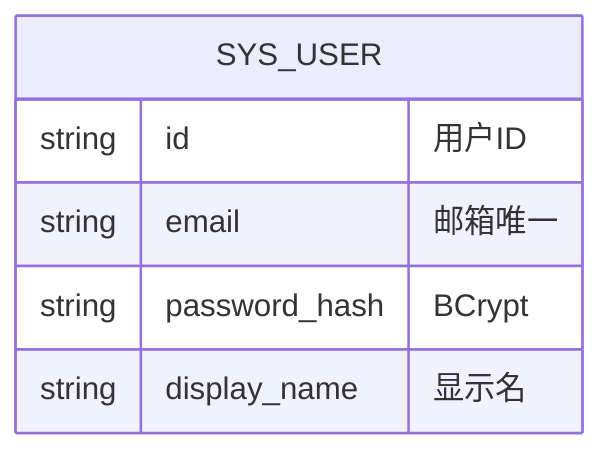
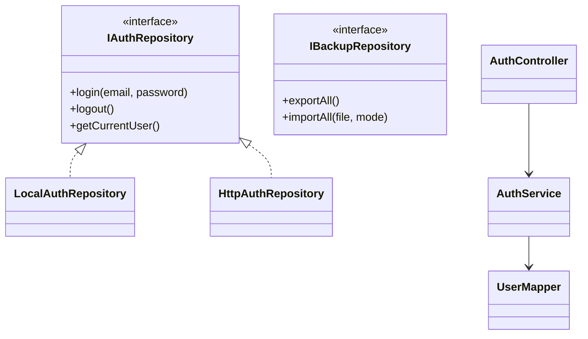

# 详细设计 — 用户与系统

> 依据《概要设计.md》M5 模块  
> **V1**：`LocalAuthRepository` + `LocalBackupRepository`（mock 登录 + JSON 文件）  
> **V2**：`AuthController` + `BackupController` + MyBatis Plus `UserMapper`  
> 数据访问层详见 `详细设计_前端数据访问层.md` | 表结构：`sys_user`（见核心 SQL）

---

## 1. 模块概述

| 项 | 说明 |
|----|------|
| 职责 | 演示登录、会话、数据备份/导入、清除缓存、个人中心统计 |
| 边界 | 不承载物品/柜/分类 CRUD |
| 原型页面 | `Login.vue`、`Profile.vue`、`Backup.vue` |
| Store | `frontend/src/stores/auth.ts` |
| Repository 接口 | `IAuthRepository`、`IBackupRepository`、`ISystemRepository` |
| V1 实现 | `local/authRepository.ts`、`local/backupRepository.ts` |
| V2 实现 | `http/authRepository.ts`、`http/backupRepository.ts` |

---

## 2. 表结构设计（V2 落库；V1 仅 auth 本地对象）

表：`sys_user`（见 `详细设计_核心数据模型.sql`）。



V1 不建表；`jiaxiang-auth` 存 `{ token, email, displayName? }`。

---

## 3. V1 前端实现（无后端）

### 3.1 实现要点

| 项 | 说明 |
|----|------|
| 认证 | `LocalAuthRepository` |
| 备份 | `LocalBackupRepository` 聚合各 Repository + IndexedDB 照片 |
| 清缓存 | `ISystemRepository.clearAllLocalData()` |
| 路由守卫 | `router.beforeEach` 读 auth，**不调 HTTP** |

### 3.2 `IAuthRepository` 接口

| 方法 | 参数 | 返回 | V1 行为 |
|------|------|------|---------|
| `login` | `email`, `password` | `AuthSession` | 校验演示账号；写 `STORAGE_KEYS.AUTH` |
| `logout` | — | `void` | 移除 auth |
| `getCurrentUser` | — | `User \| null` | 读 localStorage |
| `isAuthenticated` | — | `boolean` | token 存在即可 |

```typescript
export interface AuthSession {
  token: string
  email: string
  displayName?: string
}
```

演示账号：`admin@example.com` / `password`（与需求 6.3 一致）。

### 3.3 `IBackupRepository` 接口

| 方法 | 参数 | 返回 | V1 行为 |
|------|------|------|---------|
| `exportAll` | — | `Blob` | 聚合 JSON + 照片 Base64；触发下载 |
| `importAll` | `file`, `mode` | `void` | 校验 R017；R018 合并/覆盖写回各 Repo |

```typescript
export type BackupImportMode = 'MERGE' | 'OVERWRITE'
```

### 3.4 `ISystemRepository` 接口

| 方法 | V1 行为 |
|------|---------|
| `getStats` | `totalItems`/`totalCabinets` 调各 Repo count |
| `clearCache` | `localStorage` 业务 key + `indexedDB.deleteDatabase` |

### 3.5 UI（Element Plus）

| 页面 | 组件 |
|------|------|
| 登录 | `el-form`、`el-input`、`el-button`、`el-link` 演示填充 |
| 我的 | `el-menu` / 列表项、`el-statistic` |
| 备份 | `el-button` 导出、`el-upload` 导入、`el-radio-group` mode |

---

## 4. V2 后端设计（MyBatis Plus）

### 4.1 AuthService

包路径：`com.thunisoft.homestorage.service.AuthService`

| 方法 | 参数 | 返回 | 说明 |
|------|------|------|------|
| `login` | `LoginDTO` | `LoginVO` | BCrypt 校验；签发 JWT |
| `logout` | `token` | `void` | 可选黑名单 |
| `getCurrentUser` | `userId` | `UserVO` | 解析 SecurityContext |

### 4.2 BackupService

| 方法 | 参数 | 返回 | 说明 |
|------|------|------|------|
| `exportAll` | `userId` | `byte[]` / 流 | R016 全量 JSON |
| `importAll` | `file`, `BackupImportMode` | `void` | R017-R019 事务导入 |

### 4.3 实体类

```java
@TableName("sys_user")
public class SysUser {
    @TableId(type = IdType.ASSIGN_UUID)
    private String id;
    private String email;
    private String passwordHash;
    private String displayName;
    private LocalDateTime createTime;
    private LocalDateTime updateTime;
    @TableLogic
    private Boolean deleted;
}
```

### 4.4 Mapper

`UserMapper extends BaseMapper<SysUser>`

---

## 5. API 接口设计（REST，V2 启用）

### 5.1 认证

| Repository 方法 | HTTP | 路径 | 说明 |
|-----------------|------|------|------|
| `login` | POST | `/api/auth/login` | body: email, password → `{ token, user }` |
| `logout` | POST | `/api/auth/logout` | Header Bearer |
| `getCurrentUser` | GET | `/api/auth/me` | |

**登录成功**：

```json
{
  "code": 200,
  "message": "success",
  "data": {
    "token": "eyJhbGciOiJIUzI1NiIs...",
    "user": { "id": "usr-1", "email": "admin@example.com", "displayName": "家庭管理员" }
  }
}
```

### 5.2 备份

| Repository 方法 | HTTP | 路径 | 说明 |
|-----------------|------|------|------|
| `exportAll` | GET | `/api/backup/export` | `application/json` 下载 |
| `importAll` | POST | `/api/backup/import` | multipart + query `mode` |

### 5.3 系统

| Repository 方法 | HTTP | 路径 | 说明 |
|-----------------|------|------|------|
| `getStats` | GET | `/api/system/stats` | totalItems, totalCabinets |
| `clearCache` | DELETE | `/api/system/cache` | 可选；V1 仅本地 |

**鉴权**：除 `login` 外均需 `Authorization: Bearer {token}`。  
**前端封装**：`api/auth.ts`、`api/backup.ts` + Http 实现类。

**导出 JSON 结构（V1/V2 一致）**：

```json
{
  "version": "1.0",
  "exportedAt": "2026-05-26T12:00:00Z",
  "categories": [],
  "cabinets": [],
  "items": [],
  "photos": { "items": {}, "cabinets": {} }
}
```

---

## 6. 类图设计



---

## 7. UI/UX 设计（Element Plus）

| 页面 | 组件 | Repository |
|------|------|------------|
| `Login.vue` | `el-form` 校验 | `auth.login` |
| `Profile.vue` | 菜单入口、`el-statistic` | `system.getStats` |
| `Backup.vue` | `el-upload`、`el-radio` | `backup.export/import` |

退出：`auth.logout` → `/login`。

---

## 8. 功能清单 — V1/V2 对接映射

| 功能 | V1 | V2 API | HttpRepository |
|------|----|--------|----------------|
| 演示登录 | `LocalAuthRepository.login` | `POST /api/auth/login` | `HttpAuthRepository.login` |
| 退出登录 | 清 localStorage | `POST /api/auth/logout` + 清 token | `logout` |
| 路由鉴权 | 读本地 token | JWT 校验 | 拦截器带 Bearer |
| 当前用户 | `getCurrentUser` | `GET /api/auth/me` | 同名 |
| 数据导出 | 本地聚合 JSON 下载 | `GET /api/backup/export` | `exportAll` |
| 数据导入 | 解析写回 Repo/IDB | `POST /api/backup/import` | `importAll` |
| 合并/覆盖 | mode 参数 | query mode | 同上 |
| 个人中心统计 | 各 Repo count | `GET /api/system/stats` | 或 dashboard |
| 清除缓存 | 清 LS+IDB | 可选 DELETE cache | `clearCache` |

**切换**：`VITE_DATA_SOURCE=remote` 后登录必须走真实 JWT，axios 拦截器写入 Header。

---

## 9. 与概要设计规则映射

| 规则 | V1 | V2 |
|------|----|----|
| R016 | export 文件名含时间戳 | 同上 |
| R017 | import 前端 schema 校验 | Service 校验 |
| R018 | MERGE/OVERWRITE | 同上 |
| R019 | 导入后 `ElMessage` 提示刷新 | 同上 |

---

## 10. 安全说明

- V1：密码仅本地比对，不上传
- V2：HTTPS + BCrypt + JWT；导入限制 10MB
