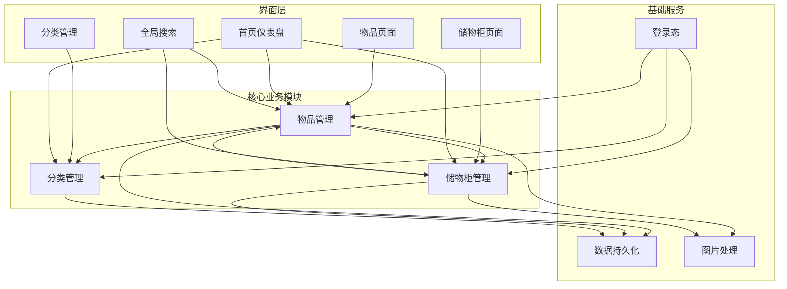
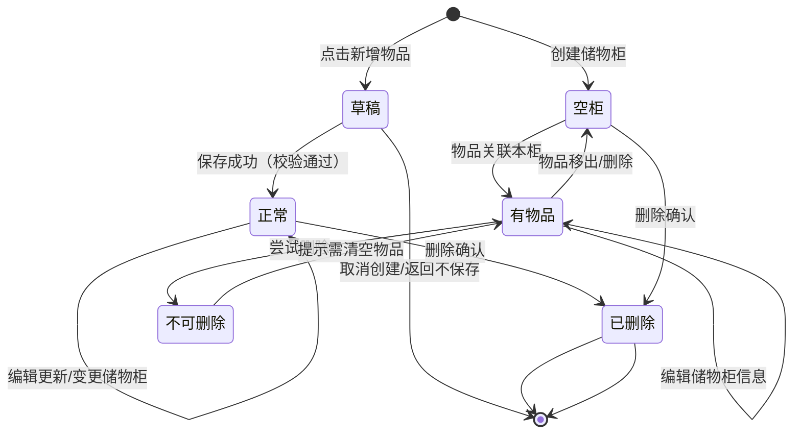

# 需求文档：家享收纳 — 家庭物品收纳管理移动端应用

---

## 第一章 需求与范围

### 1.1 业务边界

#### 包含范围

1. 物品管理：物品的创建、编辑、删除、查看、模糊检索、按时间范围检索
2. 储物柜管理：储物柜的创建、编辑、删除、查看、模糊检索、按时间范围检索
3. 物品分类（标签）管理：自定义分类的创建、编辑、删除、查看（支撑首页归类展示）
4. 首页仪表盘：按分类维度展示物品统计概览，支持快速跳转
5. 移动端适配：全站以移动端优先设计，适配手机竖屏使用
6. 照片管理：支持拍照上传、相册选择、照片预览
7. 模糊搜索：支持对物品名称、储物柜名称、位置描述进行关键字模糊匹配
8. 时间检索：支持按创建时间/存放时间进行区间筛选

#### 不包含范围（明确排除）

1. 多用户权限体系与账号注册（本期按单用户模式设计，仅提供演示登录）
2. 数据云端同步与多端协作
3. 物品借出/归还流程管理
4. 物品过期提醒（如食品保质期）
5. 条形码/二维码扫描识别
6. 社交分享功能
7. 与外部智能家居设备联动
8. 后台管理Web端

### 1.2 澄清问题与默认决策

| 序号  | 问题                | 默认决策                                                                                                        | 风险等级 |
| --- | ----------------- | ----------------------------------------------------------------------------------------------------------- | ---- |
| 1   | 物品"归类"的具体维度？      | 采用"物品分类"自定义标签维度，用户可自建分类（如：衣物、工具、药品、文件等），支持一件物品归属一个分类。低风险                                                    |      |
| 2   | "时间检索"的时间字段定义？    | 物品管理支持"存放时间"和"创建时间"两个时间字段的区间筛选；储物柜管理支持"创建时间"区间筛选。低风险                                                        |      |
| 3   | 一个物品能否同时存放在多个储物柜？ | 默认一件物品仅关联一个储物柜（一对多关系），移动物品时需变更所属储物柜。中等风险（如用户有多地点存放需求）                                                       |      |
| 4   | 是否需要物品数量/库存管理？    | 本期不包含数量管理，每条记录视为独立物品（如"螺丝刀套装"视为一个整体物品）。低风险                                                                  |      |
| 5   | 数据存储方式？           | 最终数据必须存储在服务端数据库中，所有数据操作均通过接口与后端交互，不存在纯前端本地存储模式；原型阶段可默认使用浏览器 LocalStorage/IndexedDB 进行模拟，后续研发阶段迁移至服务端数据库。低风险 |      |
| 6   | 用户是否需要拍照后立即压缩？    | 是，默认压缩图片至最大 1280px 宽，单张不超过 500KB，控制本地存储占用。低风险                                                               |      |
| 7   | 首页"仪表盘模式"具体展示内容？  | 展示各分类下的物品数量卡片、最近新增物品、按储物柜分布的统计入口。低风险                                                                        |      |
| 8   | 是否支持离线使用？         | 是，本应用为纯本地应用，完全支持离线使用。低风险                                                                                    |      |

### 1.3 关键交付物清单

- **登录页**：演示账号入口，支持快速登录
- **首页/仪表盘**：物品分类概览、最近新增、快捷搜索入口
- **物品列表页**：物品卡片列表、模糊搜索框、时间筛选器、分类筛选
- **物品新增/编辑页**：表单填写（名称、分类、照片、存放时间、选择储物柜）
- **物品详情页**：物品完整信息展示、照片大图预览、编辑/删除操作
- **储物柜列表页**：储物柜卡片列表、模糊搜索框、时间筛选器
- **储物柜新增/编辑页**：表单填写（名称、照片、位置描述）
- **储物柜详情页**：储物柜完整信息展示、关联物品列表、照片大图预览、编辑/删除操作
- **分类管理页**：分类列表、新增/编辑/删除分类
- **全局搜索页**：跨物品和储物柜的统一搜索入口（底部Tab快捷进入）
- **数据备份页**：数据导出（生成 JSON 备份文件下载到本地）、数据导入（选择备份文件恢复数据），核心解决换机数据迁移场景——用户可在旧手机导出全量数据，在新手机安装应用后通过导入功能完成数据恢复

---

## 第二章 页面设计

### 2.1 布局参考

本应用采用移动端常见的底部Tab导航 + 顶部标题栏布局模板，适配手机竖屏单手操作：

- **整体结构**：从上到下依次为「系统状态栏（时间/电量）→ 顶部标题栏（页面标题 + 右侧操作按钮）→ 内容滚动区域（可下拉刷新）→ 底部Tab导航栏（4个主Tab）」。内容区域采用卡片式布局，各模块以圆角白底卡片承载，卡片间保持适当留白。
- **顶部标题栏**：左侧可放置返回箭头（非首页时），中间为页面标题，右侧放置主要操作按钮（如"新增"、"完成"）。
- **底部Tab导航**：固定高度，包含「首页」「物品」「储物柜」「我的」四个Tab，选中态以高亮色+图标填充展示，未选中态为灰色线条图标。
- **内容区**：列表页采用垂直滚动卡片列表；表单页采用分组表单布局（每组含若干输入项）；详情页采用顶部大图 + 下方信息分组展示。
- **适配策略**：所有页面采用移动端响应式设计，宽度限制在 100vw，内容安全边距 16px，触控按钮最小尺寸 44×44px，字体最小 14px，确保可读性和可点击性。

### 2.2 页面清单

| 页面名     | 路由                 | 导航菜单层级                       | 图标               | 权限  |
| ------- | ------------------ | ---------------------------- | ---------------- | --- |
| 登录页     | /login             | 无（独立入口）                      | -                | 公开  |
| 首页      | /home              | 一级Tab（底部Tab-首页）              | home / 首页图标      | 登录后 |
| 全局搜索    | /search            | 一级Tab（底部Tab-首页内快捷入口或顶部搜索栏跳转） | search / 搜索图标    | 登录后 |
| 物品列表    | /items             | 一级Tab（底部Tab-物品）              | box / 箱子图标       | 登录后 |
| 物品新增    | /items/create      | 二级（物品列表页进入）                  | plus / 加号图标      | 登录后 |
| 物品编辑    | /items/:id/edit    | 二级（物品详情页进入）                  | edit / 编辑图标      | 登录后 |
| 物品详情    | /items/:id         | 二级（物品列表页点击卡片进入）              | file-text / 详情图标 | 登录后 |
| 储物柜列表   | /cabinets          | 一级Tab（底部Tab-储物柜）             | cabinet / 柜子图标   | 登录后 |
| 储物柜新增   | /cabinets/create   | 二级（储物柜列表页进入）                 | plus / 加号图标      | 登录后 |
| 储物柜编辑   | /cabinets/:id/edit | 二级（储物柜详情页进入）                 | edit / 编辑图标      | 登录后 |
| 储物柜详情   | /cabinets/:id      | 二级（储物柜列表页点击卡片进入）             | file-text / 详情图标 | 登录后 |
| 分类管理    | /categories        | 二级（我的页面进入）                   | tag / 标签图标       | 登录后 |
| 数据备份    | /backup            | 二级（我的页面进入）                   | download / 下载图标  | 登录后 |
| 我的/个人中心 | /profile           | 一级Tab（底部Tab-我的）              | user / 用户图标      | 登录后 |

### 2.3 页面结构

| 页面       | 主要控件                                                                   | 交互说明                                                               |
| -------- | ---------------------------------------------------------------------- | ------------------------------------------------------------------ |
| 登录页      | Logo、邮箱输入框、密码输入框、登录按钮、演示账号快捷入口                                         | 输入框支持清除按钮；密码支持显示/隐藏切换；点击登录验证后进入首页；支持点击演示账号自动填充                     |
| 首页       | 顶部搜索栏（点击跳转搜索页）、分类统计卡片横向滚动区、按储物柜入口快捷按钮                                  | 分类卡片点击跳转物品列表并自动筛选该分类；下拉刷新数据                                        |
| 全局搜索     | 顶部搜索输入框（实时模糊匹配）、Tab切换（物品/储物柜）、搜索结果列表                                   | 输入即搜索（防抖300ms）；Tab切换过滤结果类型；结果项点击进入对应详情                             |
| 物品列表     | 顶部搜索栏、时间筛选器（区间选择）、分类筛选下拉、物品卡片列表（图片+名称+分类+存放位置+存放时间）                    | 搜索/筛选条件联动刷新列表；卡片点击进入详情；右下角悬浮"+"按钮进入新增；左滑卡片显示快捷删除                   |
| 物品新增/编辑  | 物品名称输入框、分类选择器、照片上传区（支持拍照/相册，最多3张）、存放日期选择器、储物柜选择器（下拉选择已有储物柜）、备注输入框、保存按钮 | 名称必填校验；照片支持预览和删除；日期使用原生日期选择器；储物柜选择器支持搜索；表单未保存时返回弹出确认提示             |
| 物品详情     | 顶部照片轮播区、物品名称标题、信息分组卡片（分类、存放时间、所属储物柜、备注）、操作按钮组（编辑、删除）                   | 照片支持左右滑动和双击放大；点击储物柜名称跳转储物柜详情；删除需二次确认                               |
| 储物柜列表    | 顶部搜索栏、时间筛选器（区间选择）、储物柜卡片列表（照片+名称+位置描述+物品数量）                             | 同物品列表交互模式；卡片点击进入详情；悬浮"+"按钮进入新增                                     |
| 储物柜新增/编辑 | 储物柜名称输入框、照片上传区（最多3张）、位置描述输入框、保存按钮                                      | 名称必填；位置描述支持多行文本                                                    |
| 储物柜详情    | 顶部照片轮播区、储物柜名称标题、位置描述、关联物品列表（水平滚动卡片或垂直列表）、操作按钮组（编辑、删除）                  | 关联物品点击跳转物品详情；删除储物柜时若有关联物品需提示"请先移出物品"                               |
| 分类管理     | 分类列表（可拖动排序）、新增输入框（底部固定）、编辑/删除按钮                                        | 分类名称唯一校验；删除分类时若有关联物品需提示"该分类下还有X件物品，是否一并删除/转移"                      |
| 我的       | 用户信息卡片、分类管理入口、数据备份入口、数据统计（总物品数/总储物柜数）、清除缓存按钮、退出登录                      | 统计数字实时计算；清除缓存需二次确认                                                 |
| 数据备份     | 数据导出按钮（生成 JSON 备份文件并下载）、数据导入区域（点击上传备份文件进行恢复）、操作说明提示                    | 导出时打包全部数据（物品、储物柜、分类、照片）为 JSON 文件；导入时校验文件格式并合并/覆盖数据；操作前需二次确认；支持进度提示 |

---

## 第三章 模块功能与用户场景

### 3.1 功能模块清单

#### 模块一：物品管理

- **C** 创建物品：填写名称、选择分类、上传照片、选择存放日期、选择所属储物柜、添加备注
- **R** 查询物品：列表分页展示（虚拟滚动）、模糊搜索（名称）、时间区间筛选（存放时间/创建时间）、分类筛选
- **U** 编辑物品：修改任意字段，变更所属储物柜
- **D** 删除物品：单条删除，需二次确认
- **非CRUD** 物品照片管理：拍照/相册选择、压缩上传、预览轮播、删除

#### 模块二：储物柜管理

- **C** 创建储物柜：填写名称、上传照片、填写位置描述
- **R** 查询储物柜：列表展示、模糊搜索（名称/位置描述）、时间区间筛选（创建时间）
- **U** 编辑储物柜：修改名称、照片、位置描述
- **D** 删除储物柜：需确认无关联物品方可删除
- **非CRUD** 储物柜照片管理、关联物品展示

#### 模块三：分类管理

- **C** 创建分类：输入分类名称
- **R** 查询分类：列表展示
- **U** 编辑分类：修改名称
- **D** 删除分类：若有关联物品需处理关联关系

#### 模块四：搜索与仪表盘

- **非CRUD** 全局模糊搜索：跨物品名称、储物柜名称、位置描述的关键字匹配
- **非CRUD** 时间检索：日期区间选择器，支持快速选择（今天/本周/本月/自定义）

#### 模块五：用户与系统

- **非CRUD** 演示登录：支持演示账号快速进入
- **非CRUD** 数据持久化：原型阶段使用 LocalStorage/IndexedDB 模拟存储；后续研发阶段迁移至服务端数据库读写，所有数据操作通过接口与后端交互
- **非CRUD** 数据备份与恢复：支持将全量数据（物品、储物柜、分类、照片）导出为 JSON 备份文件并下载到本地，支持通过上传备份文件恢复数据，核心解决换机数据迁移场景——用户可在旧手机导出全量数据，在新手机安装应用后通过导入功能完成数据恢复
- **非CRUD** 缓存清理：一键清除所有本地数据

### 3.2 模块依赖图

### 3.3 核心用户旅程

#### 旅程一：物品收纳登记（物品管理者）

1. **入口**：用户打开App进入首页，点击底部Tab「物品」
2. **操作**：点击右下角悬浮"+"按钮 → 填写物品名称（如"冬季羽绒服"）→ 选择分类（衣物）→ 拍照上传 → 选择存放时间（今天）→ 选择储物柜（主卧衣柜）→ 点击保存
3. **状态变化**：物品状态从「无」变为「已入库」，储物柜的「物品数量」自动 +1，分类统计卡片数字 +1
4. **结果回显**：保存成功后自动返回物品列表，列表顶部显示该物品卡片，Toast提示"保存成功"

#### 旅程二：快速查找物品位置（物品查找者）

1. **入口**：用户打开App，点击首页顶部搜索栏 或 底部Tab「首页」
2. **操作**：在搜索框输入"螺丝刀" → 系统自动模糊匹配展示结果 → 点击结果中的"螺丝刀套装"
3. **状态变化**：无数据状态变更，仅展示查询结果
4. **结果回显**：进入物品详情页，顶部展示照片，信息区显示"所属储物柜：阳台工具箱"，点击储物柜名称可跳转查看储物柜详情和位置描述"阳台右侧置物架第二层"

#### 旅程三：整理储物柜并查看内部物品（储物柜管理者）

1. **入口**：用户点击底部Tab「储物柜」
2. **操作**：点击"主卧衣柜"卡片 → 进入储物柜详情 → 下滑查看"柜内物品"列表 → 看到所有存放在该柜的物品
3. **状态变化**：无状态变更（纯查询）
4. **结果回显**：物品列表以卡片形式展示各物品名称和照片，点击任一物品可查看详情

#### 旅程四：变更物品存放位置（物品迁移）

1. **入口**：用户通过搜索找到"冬季羽绒服"，进入物品详情页
2. **操作**：点击「编辑」→ 点击储物柜选择器 → 选择新储物柜（次卧衣柜）→ 更新存放时间为今天 → 点击保存
3. **状态变化**：物品所属储物柜从"主卧衣柜"变更为"次卧衣柜"；原储物柜物品数量 -1，新储物柜物品数量 +1
4. **结果回显**：返回物品详情页，储物柜信息已更新，Toast提示"更新成功"

---

## 第四章 数据模型

### 4.1 核心实体

| 实体名          | 用途                 | 生命周期                               |
| ------------ | ------------------ | ---------------------------------- |
| 物品（Item）     | 记录家中具体物品的基本信息和存放位置 | 创建（入库登记）→ 编辑（信息更新/位置变更）→ 删除（丢弃/移除） |
| 储物柜（Cabinet） | 记录存放空间的名称、位置和外观    | 创建 → 编辑 → 删除（仅当无关联物品时）             |
| 分类（Category） | 对物品进行归类，用于首页统计和筛选  | 创建 → 编辑 → 删除（需处理关联物品）              |

### 4.2 列表展示

#### 物品列表展示列

| 列名    | 说明                      |
| ----- | ----------------------- |
| 物品照片  | 首张照片缩略图，无照片显示默认占位图      |
| 物品名称  | 主标题，加粗显示                |
| 所属分类  | 副标题，灰色标签样式              |
| 所属储物柜 | 灰色小字，显示"在：xxx"          |
| 存放时间  | 灰色小字，格式"存放于 2025-01-15" |
| 操作入口  | 点击整卡进入详情                |

#### 储物柜列表展示列

| 列名    | 说明               |
| ----- | ---------------- |
| 储物柜照片 | 首张照片缩略图          |
| 储物柜名称 | 主标题，加粗显示         |
| 位置描述  | 副标题，最多显示一行，超出省略  |
| 物品数量  | 右侧角标/徽章显示"共X件物品" |
| 操作入口  | 点击整卡进入详情         |

#### 分类列表展示列

| 列名   | 说明          |
| ---- | ----------- |
| 分类名称 | 主标题         |
| 物品数量 | 右侧显示该分类下物品数 |
| 操作按钮 | 编辑/删除图标     |

### 4.3 筛选与排序

| 实体  | 筛选条件                                   | 默认排序           |
| --- | -------------------------------------- | -------------- |
| 物品  | ① 关键字（名称模糊匹配）② 分类（单选）③ 存放时间区间 ④ 创建时间区间 | 按创建时间倒序（最新的在前） |
| 储物柜 | ① 关键字（名称/位置描述模糊匹配）② 创建时间区间             | 按创建时间倒序        |
| 分类  | 无                                      | 按自定义排序（可拖拽调整）  |

### 4.4 详情页分组

#### 物品详情页分组

1. **照片区**：顶部全宽轮播图，支持左右滑动，指示器显示张数
2. **基本信息组**：物品名称（大标题）、所属分类（标签）、备注
3. **存放信息组**：存放时间、所属储物柜（可点击跳转）、创建时间
4. **操作组**：编辑按钮、删除按钮（红色）

#### 储物柜详情页分组

1. **照片区**：顶部全宽轮播图
2. **基本信息组**：储物柜名称（大标题）、位置描述、创建时间
3. **柜内物品组**：标题"柜内物品（共X件）" + 物品卡片列表（横向滚动或垂直列表）
4. **操作组**：编辑按钮、删除按钮（红色，禁用时置灰并提示原因）

---

## 第五章 业务规则与状态机

### 5.1 规则清单

| 规则编号 | 规则类型  | 规则描述                                                          | 触发场景        |
| ---- | ----- | ------------------------------------------------------------- | ----------- |
| R001 | 必填校验  | 物品名称不能为空，且长度2-50字符                                            | 物品保存/更新时    |
| R002 | 必填校验  | 储物柜名称不能为空，且长度2-30字符                                           | 储物柜保存/更新时   |
| R003 | 必填校验  | 分类名称不能为空，且长度1-20字符                                            | 分类保存/更新时    |
| R004 | 唯一性校验 | 同一分类名称不能重复（不区分大小写）                                            | 分类保存时       |
| R005 | 唯一性校验 | 同一储物柜名称不能重复                                                   | 储物柜保存时      |
| R006 | 格式校验  | 物品照片单张不超过5MB，最多上传3张                                           | 照片选择/上传时    |
| R007 | 格式校验  | 照片上传后自动压缩至宽度1280px，质量80%，目标单张≤500KB                           | 照片上传处理时     |
| R008 | 关联校验  | 删除储物柜前，必须确认该储物柜下无任何关联物品                                       | 储物柜删除时      |
| R009 | 关联规则  | 删除分类时，若该分类下有关联物品，提供两种选项：① 将物品一并删除 ② 将物品转移至"未分类"               | 分类删除时       |
| R010 | 自动填充  | 物品创建时，若用户未选择存放时间，默认填充当前日期                                     | 物品创建表单初始化时  |
| R011 | 级联更新  | 物品变更所属储物柜后，原储物柜和新储物柜的物品数量统计自动更新                               | 物品更新保存后     |
| R012 | 级联删除  | 删除物品后，所属储物柜的物品数量自动 -1                                         | 物品删除确认后     |
| R013 | 搜索规则  | 模糊搜索支持关键字对物品名称、储物柜名称、位置描述进行匹配，匹配优先级：名称 > 位置描述                 | 全局搜索输入时     |
| R014 | 搜索规则  | 时间筛选支持开始日期和结束日期的闭区间匹配                                         | 筛选条件变更时     |
| R015 | 兜底规则  | 每个新注册用户（或首次使用）自动预置3个默认分类：生活用品、衣物、工具                           | 首次初始化时      |
| R016 | 导出规则  | 数据导出时打包全量数据（物品、储物柜、分类、照片Base64）为 JSON 文件，文件名含时间戳，触发浏览器下载保存到本地 | 用户点击数据导出时   |
| R017 | 导入校验  | 导入文件需校验 JSON 格式、版本号、必填字段完整性，校验失败则阻断并提示具体错误                    | 用户选择备份文件上传时 |
| R018 | 导入策略  | 导入时提供两种模式：① 合并模式（智能去重，以新数据为准）② 覆盖模式（清空现有数据后恢复）                | 导入校验通过后     |
| R019 | 安全规则  | 导入操作前需二次确认，操作成功后提示重启应用或刷新页面以确保数据一致性                           | 用户确认导入时     |

### 5.2 状态机

本应用核心状态机围绕**物品**的生命周期展开：

| 状态  | 状态说明       | 可执行操作               |
| --- | ---------- | ------------------- |
| 草稿  | 表单填写中，未保存  | 可编辑所有字段、保存（进入正常状态）  |
| 正常  | 物品已入库，正常状态 | 可查看详情、编辑、变更储物柜、删除   |
| 已删除 | 物品已从系统中移除  | 仅前端展示Toast提示，数据物理删除 |

储物柜状态：

| 状态  | 状态说明     | 可执行操作                           |
| --- | -------- | ------------------------------- |
| 正常  | 储物柜正常使用中 | 可查看详情、编辑、添加物品（通过物品创建选择）、删除（需空柜） |
| 已删除 | 储物柜已移除   | 仅前端提示，数据物理删除                    |

### 5.3 状态流转图

---

## 第六章 角色与权限

### 6.1 角色定义

本应用为家庭单用户场景设计，简化权限体系，仅设一个角色：

| 角色名   | 职责                         | 可访问页面 | 数据可见范围 |
| ----- | -------------------------- | ----- | ------ |
| 家庭管理员 | 拥有应用的全部操作权限，可管理所有物品、储物柜和分类 | 全部页面  | 全部数据   |

### 6.2 权限矩阵

因单角色设计，权限矩阵简化为全允许模式。以下列出所有页面/操作的权限状态，便于后续扩展多用户时参考：

| 页面/操作      | 家庭管理员 | 备注                |
| ---------- | ----- | ----------------- |
| 首页仪表盘查看    | 允许    |                   |
| 全局搜索       | 允许    |                   |
| 物品列表查看     | 允许    |                   |
| 物品创建       | 允许    |                   |
| 物品编辑       | 允许    | 仅限自己创建的物品（单用户时全部） |
| 物品删除       | 允许    |                   |
| 物品详情查看     | 允许    |                   |
| 储物柜列表查看    | 允许    |                   |
| 储物柜创建      | 允许    |                   |
| 储物柜编辑      | 允许    |                   |
| 储物柜删除      | 允许    | 需满足空柜条件           |
| 储物柜详情查看    | 允许    |                   |
| 分类管理       | 允许    |                   |
| 分类创建/编辑/删除 | 允许    |                   |
| 数据导出/导入    | 允许    | 支持换机数据迁移          |
| 数据清除       | 允许    |                   |
| 退出登录       | 允许    |                   |

### 6.3 登录与演示账号

应用提供演示账号，在登录页面展示快捷入口提示：

| 账号类型 | 邮箱                                            | 密码       | 说明           |
| ---- | --------------------------------------------- | -------- | ------------ |
| 演示账号 | [admin@example.com](mailto:admin@example.com) | password | 家庭管理员，拥有全部权限 |

登录页文案提示：「演示账号：[admin@example.com](mailto:admin@example.com) / password」，支持点击自动填充。

---

## 附录：未确认事项与建议

1. **多用户扩展**：本期按单用户设计，若后续需支持家庭成员共用，建议引入「用户管理」模块和「数据共享范围」配置。
2. **云端同步**：原型阶段可默认使用浏览器 LocalStorage/IndexedDB 进行模拟，最终数据必须落库存储并通过接口与后端交互。本期已内置数据导出/导入功能（JSON 备份），支持用户换机时手动迁移数据；后续可扩展云端同步服务。
3. **物品数量管理**：如用户需要对同类物品进行数量统计（如"螺丝钉 50颗"），建议在编辑页增加可选的"数量"和"单位"字段。
4. **标签体系**：当前分类为单选，若物品需要多维度标记（如"重要""易碎""常用"），建议增加多选标签体系。

